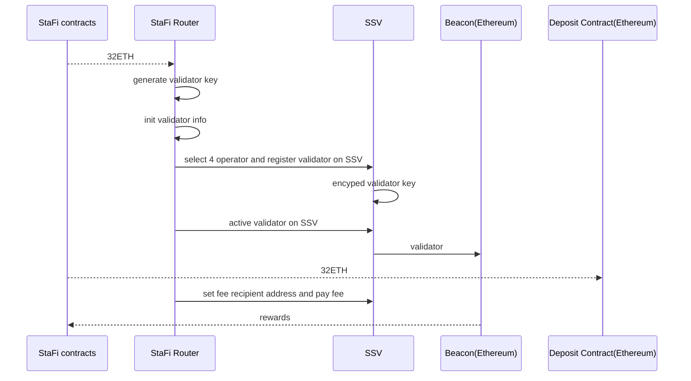

# Abstract

DVT (Distributed Validator Technology), by allowing validators to run on multiple nodes or machines, has the potential to significantly enhance the decentralization and security of Ethereum. In light of this, StaFi has decided to integrate DVT into its ETH liquid staking service via a new module called StaFi Router, which will enable us to implement this technology and further enhance the security and decentralization of the Ethereum network.

# Motivation

DVT is a technology primitive that enables an Ethereum PoS Validator to run on multiple nodes or machines, allowing an individual, group, or community of operators to operate a cluster of nodes as a single validator on Ethereum.

The current StaFi ETH liquid staking validator function supports trust validators and solo validators. To support DVT and accommodate future expansion of validator types, we have developed a new module called Router. Router will integrate existing validator services with upcoming SSV support and use its allocation algorithm to assign user staked ETH to the corresponding validator.

# Specification

## Overview


General module

Staking Pool Manager Contract：Handling user operations such as staking, unstaking, or withdrawing.
- IERC20 Token Contract: rETH token contract on Ethereum.
- Staking Pool Contracts: Implementation of the core functions of the staking pool.
- Ethereum Deposit Contract: Ethereum staking deposit contract
- StaFi Router: A router used for validator selection, activation and management.
- StaFi Relay: Off Chain: Data synchronization and scheduled trigger to update era .

## Router Algorithm

The Router will monitor the events and balance of the staking pool. The pool will set aside a specific amount of ETH for withdrawals. If the pool’s valid balance exceeds 20 ETH, users can choose to deposit 12 ETH as a solo validator and use their own server or SSV to activate the validator on the Beacon Chain. This activation process needs to be done manually. Once the pool’s valid balance exceeds 32 ETH, the Router will automatically generate a validator key, register a validator with SSV, and activate the validator on the Beacon Chain.

To increase decentralization, we plan to decrease the number of trust validators and use them only as a backup.


## SSV integration

StaFi Router integrates with SSV using its API and SDK.



- Struct `Task` : A structure containing all relevant information about the SSV integration.

```js
type Task struct {
	stop            chan struct{}
	eth1StartHeight uint64
	eth1Endpoint    string
	eth2Endpoint    string

	superNodeKeyPair *secp256k1.Keypair
	ssvKeyPair       *secp256k1.Keypair

	gasLimit            *big.Int
	maxGasPrice         *big.Int
	poolReservedBalance *big.Int
	seed                []byte
	postUptimeUrl       string
	isViewMode          bool
	targetOperatorIds   []uint64

	storageContractAddress         common.Address
	ssvNetworkContractAddress      common.Address
	ssvNetworkViewsContractAddress common.Address
	ssvTokenContractAddress        common.Address

	// --- need init on start
	dev           bool
	ssvApiNetwork string
	chain         constants.Chain

	connectionOfSuperNodeAccount *connection.Connection
	connectionOfSsvAccount       *connection.Connection

	eth1WithdrawalAdress       common.Address
	feeRecipientAddressOnStafi common.Address
	latestRegistrationNonce    uint64

	eth1Client *ethclient.Client
	eth2Config beacon.Eth2Config

	superNodeContract       *super_node.SuperNode
	userDepositContract     *user_deposit.UserDeposit
	ssvNetworkContract      *ssv_network.SsvNetwork
	ssvNetworkViewsContract *ssv_network_views.SsvNetworkViews
	ssvTokenContract        *erc20.Erc20
	withdrawContract        *withdraw.Withdraw

	ssvNetworkAbi abi.ABI

	nextKeyIndex               int
	dealedEth1Block            uint64 // for offchain state
	validatorsPerOperatorLimit uint64

	validatorsByKeyIndex      map[int]*Validator    // key index => validator, cache all validators(pending/active/exist) by keyIndex
	validatorsByPubkey        map[string]*Validator // pubkey => validator, cache all validators(pending/active/exist) by pubkey
	validatorsByValIndex      map[uint64]*Validator // val index => validator
	validatorsByValIndexMutex sync.RWMutex

	// ssv offchain state
	clusters                 map[string]*Cluster // cluster key => cluster
	feeRecipientAddressOnSsv common.Address

	handlers     []func() error
	handlersName []string
}
```

- Struct `Validator` : A structure containing all relevant information about the SSV validator.

```js
type Validator struct {
	privateKey    *bls.PrivateKey
	keyIndex      int
	status        uint8
	registedOnSSV bool
	removedOnSSV  bool
}
```

- Struct `Cluster` : A structure containing all relevant information about the SSV cluster.

```js
type Cluster struct {
	operators     []*keyshare.Operator
	operatorIds   []uint64
	latestCluster *ssv_network.ISSVNetworkCoreCluster

	balance decimal.Decimal

	managingValidators map[int]struct{} // key index

	latestUpdateClusterBlockNumber    uint64
	latestValidatorAddedBlockNumber   uint64
	latestValidatorRemovedBlockNumber uint64

	hasTargetOperators bool
}
```

- `function checkAndOnboardOnSSV`: select operators and register validator to SSV.
- `function checkAndDeposit`: generate validate key, check the pool balance and init validator.
- `function checkAndStake`: active validator on SSV.
- `function updateOperatorStatus` : check and update the status of the selection operators.
- `function checkAndSetFeeRecipient` : set fee recipient address.
- `function checkAndOffboardOnSSV` : validator on SSV exit.
- `function updateSsvOffchainState` : Syncing data and receiving events.
- `function updateCluster` : check and update the meta of the cluster.
- `function checkAndReactiveOnSSV` : reactive the cluster on SSV

## Distribute Validator Key Generate

As the development of SSV’s DKG is currently in progress, the process of generating Validator Keys requires careful consideration of performance and security to ensure a high level of decentralization.

In the long term, once SSV’s DKG is completed, we will replace the current scheme with SSV’s DKG to further enhance security and decentralization.

## Smart operator selection

SSV operators are evaluated based on various metrics such as price, status, and performance, as well as dynamic operations such as updated fees and off-boarding. To ensure optimal operator selection, the StaFi Router will periodically search for operator information on the SSV network at certain frequencies.

SSV related api:
- `/api/v4/{network}/operators`: SSV operator list
- `/api/v4/{network}/operators/operator`: SSV operator detail

# Security Considerations

StaFi Router operates as an off-chain service, there is a possibility of server failures that can result in delayed rewards and prevent the ability to run new validators in SSV. In addition, there is a risk of being targeted by attackers, which could lead to validators being slashed.

# Copyright

Copyright and related rights waived via CC0 .